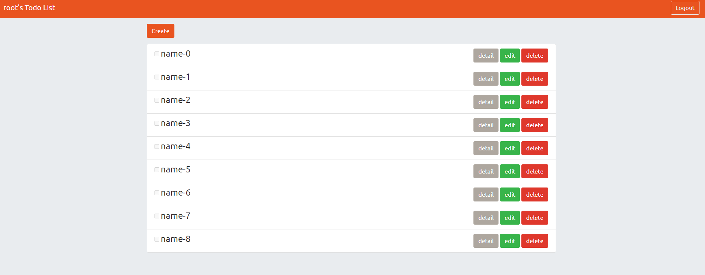

# 首頁

* 使用者可以新增、瀏覽、更改、刪除代辦事項

* 使用者可以註冊帳號
* 使用者也可以透過 Facebook Login 直接登入

# 環境建置
* bcryptjs: 2.4.3
* body-parser: 1.19.0
* connect-flash: 0.1.1
* dotenv: 10.0.0
* express: 4.17.1
* express-handlebars: 5.3.3
* express-session: 1.17.2
* method-override: 3.0.0
* mysql2: 2.3.0
* passport: 0.4.1
* passport-facebook: 3.0.0
* passport-local: 1.0.0
* sequelize: 6.6.5
* sequelize-cli: 6.2.0

# 使用方法
1. 終端機輸入指令 git clone https://github.com/godzillalogan/todo-sequelize.git
2. 進入專案 cd todo-sequelize
3. 安裝相關套件 npm install
4. 新增種子資料 npm run seed
5. 開啟專案 npm run dev
6. 出現以下訊息就可以在localhost:3000開啟本專案App is running on http://localhost:3000
